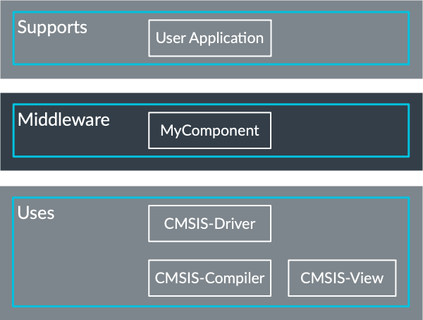

# ACME-Middleware

The ACME-Middleware software pack is an exemplary pack that shows how to create pure sooftware packs. It contains ...

The ACME-Middleware can be used by any user application.

ACME-Middleware uses a CMSIS-RTOS2-based real-time operating system for task scheduling, for example [Keil RTX5](https://github.com/ARM-software/CMSIS-RTX) or [CMSIS-FreeRTOS](https://github.com/arm-software/CMSIS-freertos).

[Optional] The [CMSIS-Compiler](https://github.com/arm-software/cmsis-compiler) and [CMSIS-View](https://github.com/arm-software/cmsis-view) components can display events and static information from all ACME-Middleware components.

The software components that are part of this [CMSIS-Pack](https://open-cmsis-pack.github.io/Open-CMSIS-Pack-Spec/main/html/index.html) are:

- **MyGroup**: Lorem ipsum.

> *Note:*  
> Each component is configurable for a wide range of applications and requires the driver interface as described by the [CMSIS-Driver standard](https://arm-software.github.io/CMSIS_6/latest/Driver/index.html). Check with your silicon vendor about the availability of CMSIS-Drivers for your selected microcontroller device.

## Availability

The ACME-Middleware is available as a commercial product to all users of Arm Cortex-M-based processors. It does not require a specific toolchain or IDE license and can be built with major toolchains, such as Arm Compiler 6, GCC, and LLVM.